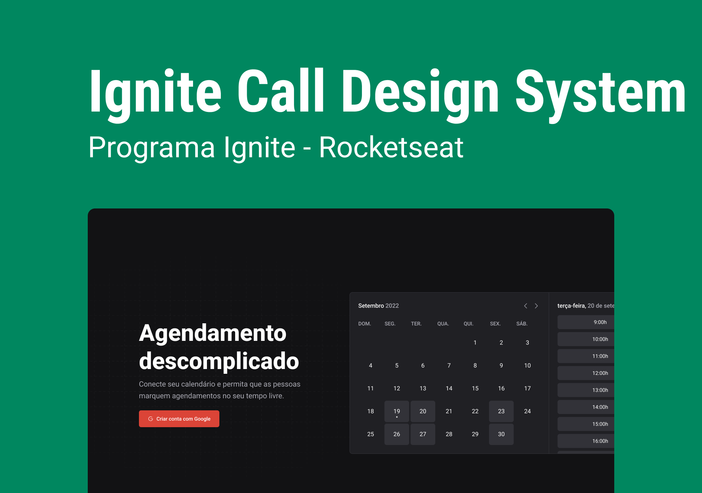

<h1 align="center">Ignite Call Design System</h1>

## Project developed to learn how to create a Design System with Storybook

---

## 🎥 Preview

### About the project 💻

 

---

## 📚 Learning

All the things that I learned and practiced with this project

- I learned how `to create a Design System` using Storybook
- I learned about `workflows` with Github
- I learned how `to publish a project into NPM`

 

---

## 🧪 Technologies

This project was developed using de following technologies:

- [React](https://react.dev/)
- [Typescript](https://www.typescriptlang.org/)
- [Vite](https://vitejs.dev/)
- [Storybook](https://storybook.js.org/)
- [Turbo](https://turbo.build/)
- [Stitches](https://stitches.dev/)
- [Radix](https://www.radix-ui.com/)
- [tsup](https://github.com/egoist/tsup)

 

---

## 🔖 Layout

You can view the project layout through the links below:

- [Layout](https://www.figma.com/file/cowwFHJimoyQomSAynMjGz/Ignite-Call?node-id=4:412)

Remembering that you need to have a [Figma](http://figma.com/) account to access it.

 

---

Developed by [ricardorhv](https://github.com/ricardorhv) 🖤
